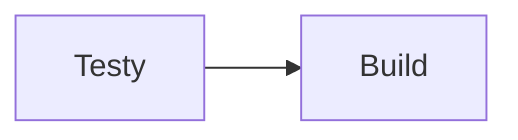

# 🛠️ CI/CD Demo – GitLab + Docker

W pełni konteneryzowane środowisko **GitLab Community Edition** z samozarejestrowanym Docker Runnerem oraz panelem **Portainer**.
Uruchomisz je jednym poleceniem, by ćwiczyć zarządzanie pipeline’ami, testy jednostkowe i automatyczny deployment.

---

## Spis treści
1. [O projekcie](#o-projekcie)
2. [Stos technologiczny](#stos-technologiczny)
3. [Wymagania](#wymagania)
4. [Instalacja](#instalacja)
5. [Struktura kontenerów](#struktura-kontenerów)
6. [Pipeline CI/CD](#pipeline-cicd)
7. [Zarządzanie](#zarządzanie)
8. [Rejestracja GitLab Runnera](#rejestracja-gitlab-runnera)
9. [Przydatne komendy](#przydatne-komendy)
10. [Licencja](#licencja)

---

## O projekcie

Projekt demonstruje **kompletny cykl życia oprogramowania** (lint → test → build → sast → dast → deploy) w GitLab CI/CD.
Po pierwszym uruchomieniu otrzymujesz:

* własny serwer **GitLab CE** (z prekonfigurowanym użytkownikiem `root`);
* kontener **GitLab Runner** w trybie *Docker‑in‑Docker*;
* panel **Portainer** do graficznego podglądu kontenerów;
* przykładową aplikację Python (`projekt_automatyzacja`) z testami `pytest`;

---

## Stos technologiczny

| Warstwa        | Technologia                     |
| -------------- | ------------------------------- |
| VCS + CI/CD    | GitLab CE 16.10                 |
| Runner         | GitLab Runner (Docker executor) |
| Orkiestracja   | docker‑compose v2               |
| Aplikacja demo | Python 3.12, customtkinter      |
| Testy          | pytest, test.py                 |
| Zarządzanie    | Portainer CE 2.20               |

---

## Wymagania

* **Docker ≥ 24.0** oraz **docker‑compose v2**
* min. **4 GB RAM** i **10 GB wolnego miejsca**
* Wolne porty: `80`, `443`, `8929`, `9000`, `9090`, `9443`

---

## Instalacja

```bash
# 1. Klonuj repo
git clone https://example.com/user/gitlab_env.git
cd gitlab_env

# 2. Podnieś środowisko (pierwszy start ~5‑10 min)
docker compose up --build -d

# 3. Zaloguj się do GitLab
    URL: http://localhost/
    Login: usr | Hasło: 123password
```

> 💡 **Tip:** Podgląd logów `docker compose logs -f gitlab`.

---

## Struktura kontenerów

| Kontener | Obraz | Porty | Rola |
| -------- | ----- | ----- | ---- |
| `gitlab` | `gitlab/gitlab-ce:16.10.6-ce.0` | 80, 443, 8929, 9090 | Repo + serwer CI |
| `gitlab-runner` | `gitlab/gitlab-runner:alpine-v16.10.0` | — | Wykonuje joby CI |
| `portainer` | `portainer/portainer-ce:2.20` | 9443, 9000 | UI Docker |
| `user_adder` | custom Python                 | — | Dodaje konto usr do gitlab |
| `runner_ip_changer` | custom Python          | — | Aktualizuje Runner |

Pełny `docker-compose.yaml` znajdziesz w [`/docker-compose.yaml`](./docker-compose.yaml).

---

## Pipeline CI/CD



Etapy domyślnego pipeline:

1. **Testy** – `pytest` + raport pokrycia xml
2. **Build** – budowa exec 

---

## Zarządzanie

* **Portainer:** <https://localhost:9443>
* **Runner logs:** `docker compose logs -f gitlab-runner`
* **Zmiana hasła root:** `docker exec -it gitlab gitlab-rake "gitlab:password:reset[root]"`

---

## Rejestracja GitLab Runnera

Po pierwszym uruchomieniu środowiska zarejestruj własnego runnera:

1. **Zaloguj się do GitLab**  
   - URL: `http://localhost/`  
   - Użytkownik: `usr`  
   - Hasło: `123password`

2. **Przejdź do swojego projektu**  
   Wybierz projekt, w którym chcesz uruchamiać pipeline’y.

3. **Otwórz ustawienia runnerów**  
   W bocznym menu GitLab wybierz **Settings → CI/CD → Runners**.

4. **Skopiuj token rejestracyjny**  
   W sekcji **Runners** kliknij **Create project runner**, zaznacz **Run untagged jobs**, **create runner** i skopiuj wyświetlony **token**.

5. **Wstaw token do konfiguracji**  
   Otwórz plik `gitlab-runner-config/config.toml` i podmień linię z tokenem:
   ```toml
   [[runners]]
    name = "gitlab-runner"
    url = "http://gitlab/"
    id = 46
     # zastąp poniższy placeholder swoim tokenem
    token = "TU_WSTAW_SWÓJ_TOKEN"
    token_obtained_at = 2025-04-07T14:27:06Z
    token_expires_at = 0001-01-01T00:00:00Z
    executor = "docker"

6. Zweryfikuj status
   Nowy runner powinien pojawić się w panelu GitLab jako **active**.

